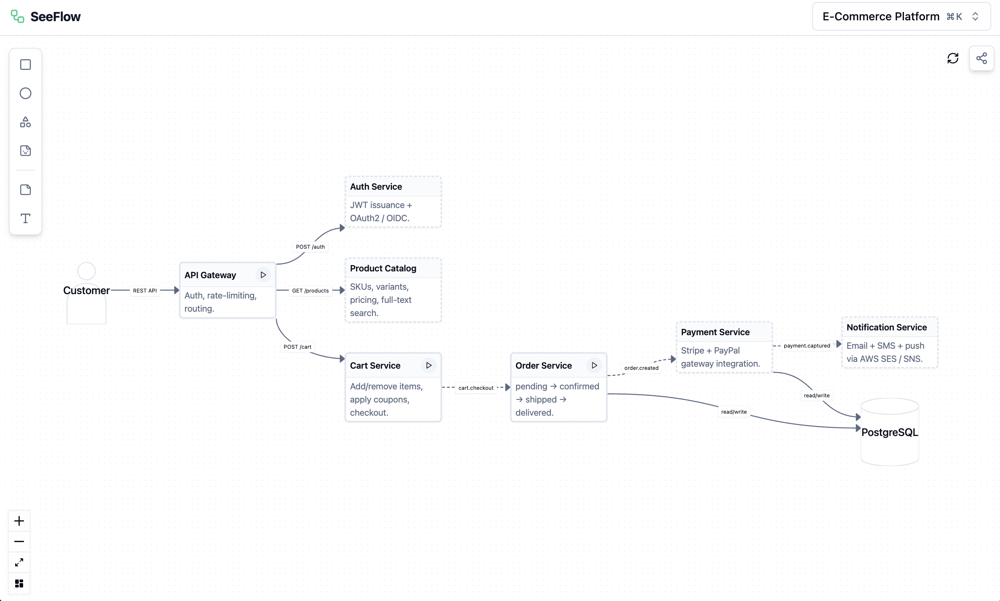

# SeeFlow

> Architecture diagrams that actually run, generated by AI agents.



Turn your static system architecture into a live control panel wired directly to your running application. Click a node, fire a real request, watch downstream services light up as your app emits events back.

## Why

- **Diagram drift** — Confluence pages go stale. SeeFlow breaks loudly when your actual system changes.
- **Onboarding friction** — New engineers click through a live flow instead of reading six-month-old docs.
- **Demo tedium** — Script it once, replay it flawlessly. No more manually clicking through microservices for stakeholders.

## Quick Start

The SeeFlow plugin reads your codebase, understands your architecture, and generates the full diagram and request scripts automatically. Works with Claude Code, Codex, Cursor, and Windsurf.

### 1. Start the studio

```bash
npx tuongaz/seeflow start
```

### 2. Install the plugin

**Skill installer (recommended):**

```bash
npx skills add tuongaz/seeflow
```

```bash
/plugin marketplace add tuongaz/seeflow
/plugin install create-seeflow@seeflow
```

```bash
curl -fsSL https://raw.githubusercontent.com/tuongaz/seeflow/main/install.sh | bash
```

**Cursor:** Auto-discovers the plugin via `.cursor-plugin/plugin.json` when this repo is cloned. No manual installation needed — just clone and open in Cursor.

---

**Then just ask:**

```
/create-seeflow show me the shopping cart feature
```

The plugin scans your routes and database connections, generates `seeflow.json`, wires up demo scripts, and opens the canvas at localhost:4321.

## MCP server

SeeFlow ships an MCP server so any MCP-aware editor can list, register, and edit demos directly. The studio must be running first.

**Claude Code:**

```bash
claude mcp add seeflow -- npx -y -p @tuongaz/seeflow seeflow-mcp
```

**Via `.mcp.json`** (Cursor, Windsurf, etc.):

```json
{
  "mcpServers": {
    "seeflow": {
      "command": "npx",
      "args": ["-y", "-p", "@tuongaz/seeflow", "seeflow-mcp"]
    }
  }
}
```

The MCP server talks to `http://127.0.0.1:4321/mcp` by default. Override with `SEEFLOW_STUDIO_URL` if needed.

## Develop

```bash
git clone https://github.com/tuongaz/seeflow.git
cd seeflow && bun install
make dev   # Vite (5173) + Hono studio (4321), both hot-reloading
```

`make help` lists every target. Toolchain: Bun ≥ 1.3, Hono, React Flow, Zod, Biome.

## Status

Early-stage. The schema is stable enough to author against, but expect changes. Issues, ideas, and PRs welcome.

## License

MIT — see [`LICENSE`](./LICENSE).
